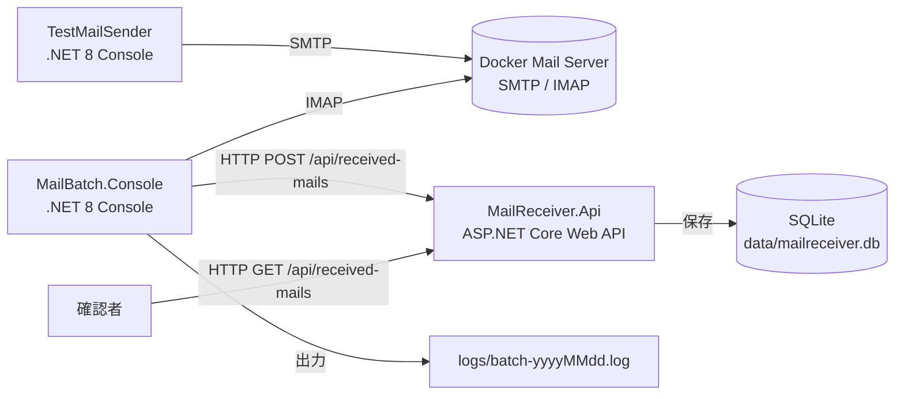

# 構成設計

## 全体構成

## コンテナ構成

`docker-compose.yml` では、初期スコープとして次のサービスを定義する。

| サービス | 役割 | 主な公開ポート例 |
| --- | --- | --- |
| mailserver | SMTP / IMAP を提供するテスト用メールサーバ | SMTP: 1025、IMAP: 1143、Web UI がある場合は 8025 |
| mailreceiver-api | メール連携 API | HTTP: 5000 |

メールサーバ製品は実装時に確定する。候補は Mailpit、GreenMail、MailHog 系の開発用メールサーバである。IMAP が必要なため、SMTP のみの製品は避ける。

## ホスト側ディレクトリ

| パス | 用途 |
| --- | --- |
| `src/MailBatch.Console/` | IMAP 取得と API 連携を行うバッチアプリ。 |
| `src/MailReceiver.Api/` | POST 受信、SQLite 保存、GET 確認を行う API。 |
| `src/TestMailSender/` | SMTP でテストメールを投入する補助アプリ。 |
| `logs/` | バッチログ出力先。日付単位で `batch-yyyyMMdd.log` を作成する。 |
| `data/` | SQLite DB ファイル `mailreceiver.db` の配置先。 |

## 通信設計

| From | To | プロトコル | 内容 |
| --- | --- | --- | --- |
| TestMailSender | mailserver | SMTP | テストメールを投入する。 |
| MailBatch.Console | mailserver | IMAP | メールボックスから対象メールを検索・取得する。 |
| MailBatch.Console | MailReceiver.Api | HTTP | 抽出したメール情報を POST する。 |
| 確認者 | MailReceiver.Api | HTTP | GET API で保存済みデータを確認する。 |

## 設定管理

設定値は `appsettings.json` と環境変数で管理する。Docker Compose から起動する場合は環境変数で上書きできるようにする。

主な設定項目は次の通り。

| アプリ | 設定 | 例 |
| --- | --- | --- |
| MailBatch.Console | `Imap:Host` | `localhost` または Compose サービス名 |
| MailBatch.Console | `Imap:Port` | `1143` |
| MailBatch.Console | `Imap:UserName` | `test@example.local` |
| MailBatch.Console | `Imap:Password` | `password` |
| MailBatch.Console | `Api:BaseUrl` | `http://localhost:5000` |
| MailBatch.Console | `MailFilter:SubjectContains` | `連携対象` |
| MailReceiver.Api | `ConnectionStrings:MailReceiver` | `Data Source=../../data/mailreceiver.db` |
| TestMailSender | `Smtp:Host` | `localhost` |
| TestMailSender | `Smtp:Port` | `1025` |
