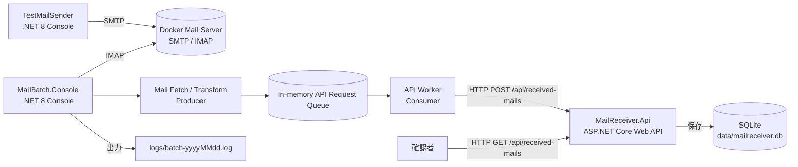

# 構成設計

## 全体構成

## コンテナ構成

`docker-compose.yml` では、初期スコープとして次のサービスを定義する。

| サービス | 役割 | 主な公開ポート例 |
| --- | --- | --- |
| mailserver | SMTP / IMAP を提供するテスト用メールサーバ | SMTP: 1025、IMAP: 1143、Web UI がある場合は 8025 |
| mailreceiver-api | メール連携 API | HTTP: 5000 |

メールサーバ製品は GreenMail Standalone を採用する。採用理由は、開発・テスト用途の軽量なサンドボックスとして SMTP と IMAP を同一コンテナで提供でき、Docker Compose から固定ユーザーを初期定義できるためである。Mailpit や MailHog は SMTP 受信と Web UI の確認には便利だが、初期スコープで必須となる IMAP 取得検証を満たす構成が主目的ではないため採用しない。

GreenMail は Web UI ではなく管理 API を `8080` で提供するが、初期スコープの確認経路は IMAP と `MailReceiver.Api` の GET API とするため、管理 API は Compose 内部利用に留め、ホストへは公開しない。必要になった時点で `8080:8080` の公開を追加する。

## ホスト側ディレクトリ

| パス | 用途 |
| --- | --- |
| `src/MailBatch.Console/` | IMAP 取得、メール加工、内部キュー投入、API 連携を行うバッチアプリ。 |
| `src/MailReceiver.Api/` | POST 受信、SQLite 保存、GET 確認を行う API。 |
| `src/TestMailSender/` | SMTP でテストメールを投入する補助アプリ。 |
| `logs/` | バッチログ出力先。日付単位で `batch-yyyyMMdd.log` を作成する。 |
| `data/` | SQLite DB ファイル `mailreceiver.db` の配置先。 |

## 通信設計

| From | To | プロトコル | 内容 |
| --- | --- | --- | --- |
| TestMailSender | mailserver | SMTP | テストメールを投入する。 |
| MailBatch.Console | mailserver | IMAP | メールボックスから対象メールを検索・取得する。 |
| MailBatch.Console Producer | Internal Queue | In-process | API リクエスト型へ加工済みの送信用データを追加する。 |
| MailBatch.Console Consumer | Internal Queue | In-process | キューから送信用データを取得する。 |
| MailBatch.Console Consumer | MailReceiver.Api | HTTP | キューから取得した送信用データを POST する。 |
| 確認者 | MailReceiver.Api | HTTP | GET API で保存済みデータを確認する。 |

## 設定管理

設定値は `appsettings.json` と環境変数で管理する。Docker Compose から起動する場合は環境変数で上書きできるようにする。

主な設定項目は次の通り。

| アプリ | 設定 | 例 |
| --- | --- | --- |
| MailBatch.Console | `Imap:Host` | Dev Container / Compose 内: `mailserver` / ホスト OS: `localhost` |
| MailBatch.Console | `Imap:Port` | Dev Container / Compose 内: `3143` / ホスト実行: `1143` |
| MailBatch.Console | `Imap:UserName` | `test@example.local` |
| MailBatch.Console | `Imap:Password` | `password` |
| MailBatch.Console | `Api:BaseUrl` | Dev Container / Compose 内: `http://mailreceiver-api:8080` / ホスト OS: `http://localhost:5000` |
| MailBatch.Console | `MailFilter:SubjectContains` | `連携対象` |
| MailReceiver.Api | `ConnectionStrings:MailReceiver` | `Data Source=../../data/mailreceiver.db` |
| TestMailSender | `Smtp:Host` | Dev Container / Compose 内: `mailserver` / ホスト OS: `localhost` |
| TestMailSender | `Smtp:Port` | Dev Container / Compose 内: `3025` / ホスト実行: `1025` |

## 開発用メールサーバ設定

`MailBatchSample/docker-compose.yml` の `mailserver` サービスで GreenMail Standalone を起動する。SMTP と IMAP のみを有効化し、ローカル検証で衝突しにくいホスト側ポートへ公開する。

| 項目 | Dev Container / Compose 内実行時 | ホスト OS 実行時 |
| --- | --- | --- |
| SMTP ホスト | `mailserver` | `localhost` |
| SMTP ポート | `3025` | `1025` |
| IMAP ホスト | `mailserver` | `localhost` |
| IMAP ポート | `3143` | `1143` |
| ユーザー名 | `test@example.local` | `test@example.local` |
| パスワード | `password` | `password` |
| メールボックス | `INBOX` | `INBOX` |

テスト用アカウントは GreenMail の `-Dgreenmail.users=test:password@example.local` と `-Dgreenmail.users.login=email` で定義し、IMAP/SMTP 認証ではメールアドレス形式の `test@example.local` を利用する。Compose 起動時に `MAILSERVER_USERS`、`MAILSERVER_SMTP_HOST_PORT`、`MAILSERVER_IMAP_HOST_PORT` を指定すると、ユーザー定義またはホスト側公開ポートを上書きできる。
