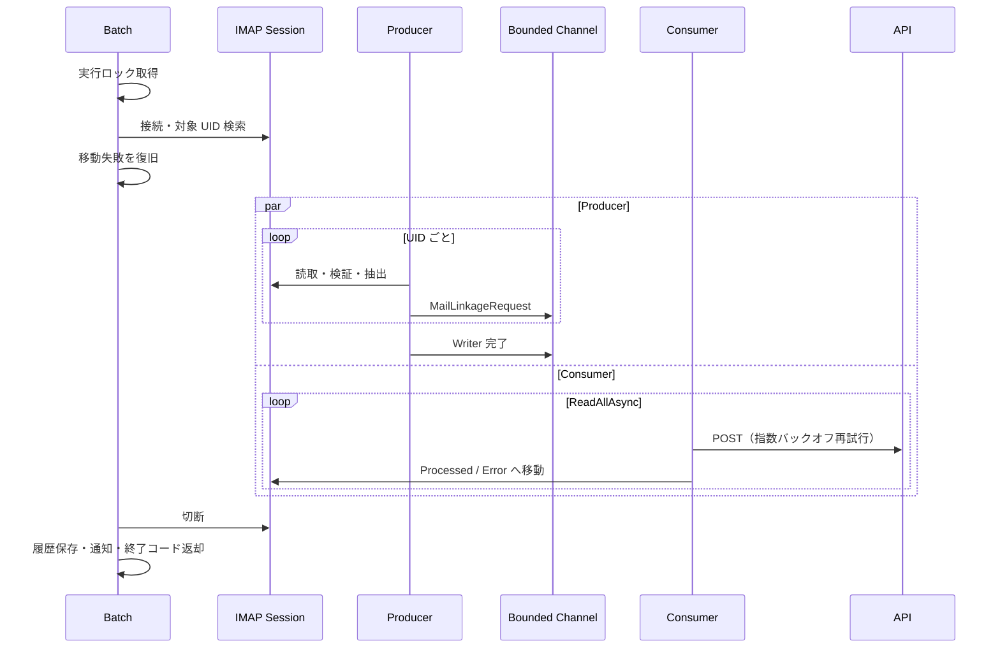

# アプリケーション設計

## MailBatch.Console

### 責務

- IMAP セッションを接続し、対象 UID を検索する。
- メールを読み取り・検証・加工して bounded channel へ追加する。
- キューを並行消費して API へ POST し、結果を SQLite とログへ記録する。
- 処理済み台帳と移動失敗台帳で二重送信を防ぎ、メールを `Processed` / `Error` へ移動する。
- 実行履歴を保存し、実行結果・入力不正・メトリクス異常を SMTP 通知する。

### 処理フロー

`IReceivedMailSession` は接続ライフサイクルとメール読取を担い、検索は `IReceivedMailSearcher`、移動は `IReceivedMailMover` に分離する。同じ IMAP 接続をバッチ実行中に共有し、開始時に未復旧の移動を再試行する。

### キューとエラー処理

- `Processing:RequestQueueCapacity` を容量とする `Channel<T>` で Producer / Consumer を並行実行する。ポーリングせず、Writer の完了まで `ReadAllAsync` で待つ。
- 片側の致命的失敗時は共有キャンセルトークンで他方も停止する。入力形式不正は通知後に処理済みとし、バッチは継続する。
- API の一時エラーと IMAP の接続エラーは設定回数だけ指数バックオフで再試行する。API 最終失敗は `Error`、成功と入力不正は `Processed` へ移動する。
- API 成功後の移動失敗は台帳へ残す。次回起動時に移動を復旧し、未復旧中の UID は再送しない。
- 終了コードは成功 `0`、致命的エラー `1`、一部処理失敗 `2`、キャンセル `130` とする。ファイルロックを取得できない二重起動は致命的エラーとする。

### 保存・通知・ログ

`Batch:LogDirectory` の `mail-processing.db` に `processed_mails`、`mail_move_failures`、`batch_runs`、`api_execution_results` を保存する。ログと保持対象の台帳は `Batch:LogRetentionDays` 日後に削除し、移動失敗台帳は復旧成功時だけ削除する。

Serilog の日次ログには RunId、UID / UIDVALIDITY、件数、API の実行 ID・ステータス・所要時間、例外を記録し、パスワードや本文全体は出力しない。SMTP 通知は管理者向け実行結果、送信者向け入力エラー、管理者向けメトリクスアラートの3テンプレートを設定から生成する。

### メール抽出

| 項目 | 生成方法 |
| --- | --- |
| MailId | IMAP の UID と UIDVALIDITY |
| Key | 本文中で唯一の `Key: 英数字` 行 |
| Message | 件名と MIME 本文を連結した先頭 500 文字 |

## MailReceiver.Api

### 責務

- バッチから送信されたメール情報を受信する。
- 入力値を検証する。
- SQLite に保存する。
- 保存済みデータを GET API で返却する。
- API 側でも最低限の構造化ログを出力する。

### エンドポイント概要

| メソッド | パス | 内容 |
| --- | --- | --- |
| `POST` | `/api/received-mails` | メール情報を保存する。 |
| `GET` | `/api/received-mails` | 保存済みメール一覧を取得する。 |
| `GET` | `/api/received-mails/{id}` | 指定 ID の保存済みメールを取得する。 |
| `GET` | `/health` | 起動確認用。 |

## TestMailSender

### 責務

- SMTP サーバへ接続する。
- テストメールを送信する。
- 件名、本文、送信者、宛先を設定で変更できるようにする。

### 利用シナリオ

1. Docker Compose でメールサーバと API を起動する。
2. TestMailSender を実行し、対象条件に一致する件名のメールを投入する。
3. MailBatch.Console を実行する。
4. GET API または DB で保存結果を確認する。
