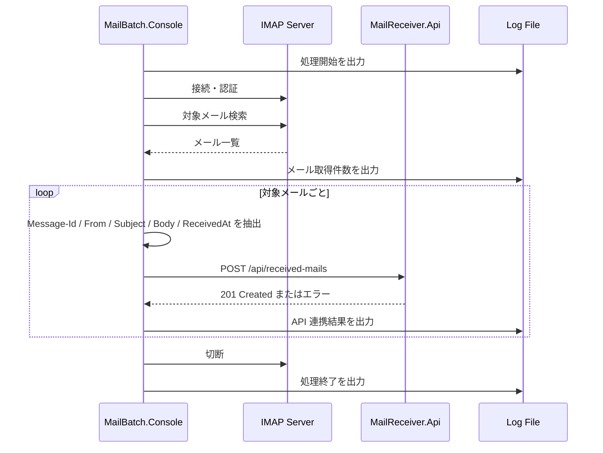

# アプリケーション設計

## MailBatch.Console

### 責務

- IMAP サーバへ接続する。
- 対象条件に一致するメールを検索・取得する。
- メールから連携項目を抽出する。
- 抽出データを API へ POST する。
- 処理状況とエラーをログファイルへ出力する。

### 処理フロー

### メール抽出方針

| 項目 | 取得元 | 備考 |
| --- | --- | --- |
| Message-Id | メールヘッダ `Message-Id` | 重複検知の候補キーにする。 |
| Sender | `From` ヘッダ | 表示名とメールアドレスの扱いは実装時に統一する。 |
| Subject | `Subject` ヘッダ | MIME デコード後の値を送信する。 |
| Body | text/plain 優先 | text/plain がなければ HTML から簡易テキスト化を検討する。 |
| ReceivedAt | IMAP の内部日付または `Date` ヘッダ | 初期実装では取得しやすい値を採用し、仕様として明記する。 |

### ログ方針

Serilog を使用し、`logs/batch-yyyyMMdd.log` に日次ファイルを出力する。

出力イベント例は次の通り。

- バッチ開始
- 設定読み込み完了。ただしパスワードなどの秘匿値は出力しない。
- IMAP 接続開始・成功・失敗
- 対象メール取得件数
- API 連携成功。Message-Id、HTTP ステータス、保存 ID を記録する。
- API 連携失敗。Message-Id、HTTP ステータス、エラーメッセージを記録する。
- 例外発生時の例外種別、メッセージ、スタックトレース
- バッチ終了

## MailReceiver.Api

### 責務

- バッチから送信されたメール情報を受信する。
- 入力値を検証する。
- SQLite に保存する。
- 保存済みデータを GET API で返却する。
- API 側でも最低限の構造化ログを出力する。

### エンドポイント概要

| メソッド | パス | 内容 |
| --- | --- | --- |
| `POST` | `/api/received-mails` | メール情報を保存する。 |
| `GET` | `/api/received-mails` | 保存済みメール一覧を取得する。 |
| `GET` | `/api/received-mails/{id}` | 指定 ID の保存済みメールを取得する。 |
| `GET` | `/health` | 起動確認用。 |

## TestMailSender

### 責務

- SMTP サーバへ接続する。
- テストメールを送信する。
- 件名、本文、送信者、宛先を設定で変更できるようにする。

### 利用シナリオ

1. Docker Compose でメールサーバと API を起動する。
2. TestMailSender を実行し、対象条件に一致する件名のメールを投入する。
3. MailBatch.Console を実行する。
4. GET API または DB で保存結果を確認する。
