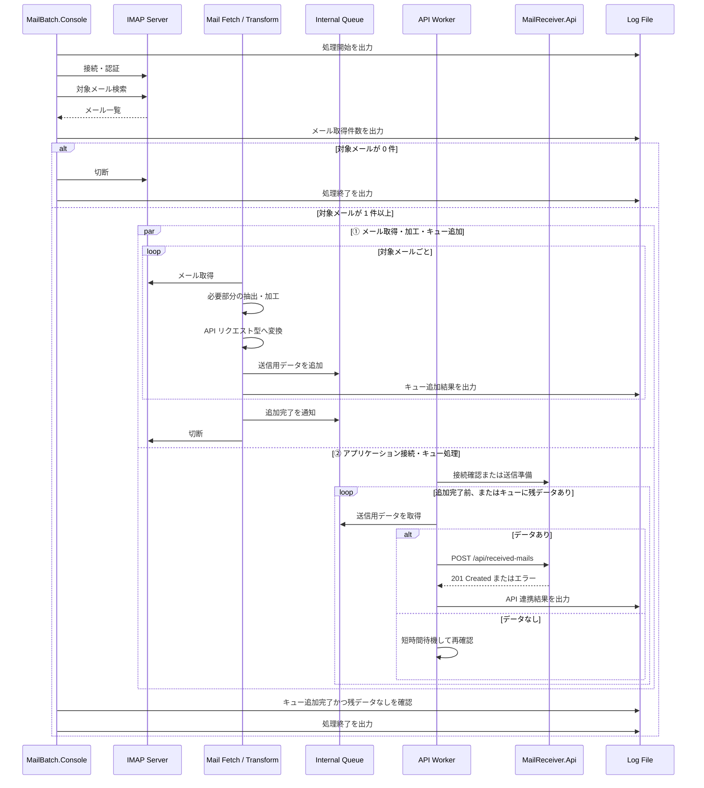

# アプリケーション設計

## MailBatch.Console

### 責務

- IMAP サーバへ接続する。
- 対象条件に一致するメールを検索・取得する。
- メールから連携項目を抽出し、必要に応じて API 送信用データへ加工する。
- API 送信用データを内部キューへ追加する。
- 内部キューから API 送信用データを取り出し、API へ POST する。
- 処理状況とエラーをログファイルへ出力する。

### 処理フロー

`MailBatch.Console` は、メール取得処理と API 連携処理を分離する。メールをそのまま API へ送る前提にはせず、メール本文の一部抽出や形式変換などを行ったうえで、API のリクエスト型に合わせたデータを内部キューへ追加する。API 連携処理はキューを監視し、データがある限り POST を継続する。

### キュー処理方針

- キューに格納するデータは、メールオブジェクトそのものではなく、`MailReceiver.Api` の POST API に合わせたリクエスト型とする。
- メール取得・加工側を Producer、API 連携側を Consumer として分離する。
- 対象メールが 1 件以上ある場合のみ、Producer と Consumer を並行実行する。
- Producer は対象メールごとに「メール取得 → 必要部分の抽出・加工 → API リクエスト型への変換 → キュー追加」を行う。
- Consumer はアプリケーション接続後、Producer の追加完了通知を受け取るまで、またはキューに残データがある限り、キューを while で確認し続ける。
- キューが一時的に空でも Producer が追加完了していない場合は、バッチを終了せず短時間待機して再確認する。
- Producer の追加完了後、キューに残データがなくなった時点で Consumer を終了し、バッチ全体を終了する。
- API 連携失敗時の扱いは初期スコープでは既存方針どおりログ出力を中心とし、複雑なリトライや永続キューは対象外とする。

### メール抽出方針

| 項目 | 取得元 | 備考 |
| --- | --- | --- |
| Message-Id | メールヘッダ `Message-Id` | 重複検知の候補キーにする。 |
| Sender | `From` ヘッダ | 表示名とメールアドレスの扱いは実装時に統一する。 |
| Subject | `Subject` ヘッダ | MIME デコード後の値を送信する。 |
| Body | text/plain 優先 | text/plain がなければ HTML から簡易テキスト化を検討する。 |
| ReceivedAt | IMAP の内部日付または `Date` ヘッダ | 初期実装では取得しやすい値を採用し、仕様として明記する。 |

### ログ方針

Serilog を使用し、`logs/batch-yyyyMMdd.log` に日次ファイルを出力する。

出力イベント例は次の通り。

- バッチ開始
- 設定読み込み完了。ただしパスワードなどの秘匿値は出力しない。
- IMAP 接続開始・成功・失敗
- 対象メール取得件数
- キュー追加成功・失敗。Message-Id、キュー追加件数、加工結果の概要を記録する。
- Producer の追加完了、Consumer のキュー残データなし確認。
- API 連携成功。Message-Id、HTTP ステータス、保存 ID を記録する。
- API 連携失敗。Message-Id、HTTP ステータス、エラーメッセージを記録する。
- 例外発生時の例外種別、メッセージ、スタックトレース
- バッチ終了

## MailReceiver.Api

### 責務

- バッチから送信されたメール情報を受信する。
- 入力値を検証する。
- SQLite に保存する。
- 保存済みデータを GET API で返却する。
- API 側でも最低限の構造化ログを出力する。

### エンドポイント概要

| メソッド | パス | 内容 |
| --- | --- | --- |
| `POST` | `/api/received-mails` | メール情報を保存する。 |
| `GET` | `/api/received-mails` | 保存済みメール一覧を取得する。 |
| `GET` | `/api/received-mails/{id}` | 指定 ID の保存済みメールを取得する。 |
| `GET` | `/health` | 起動確認用。 |

## TestMailSender

### 責務

- SMTP サーバへ接続する。
- テストメールを送信する。
- 件名、本文、送信者、宛先を設定で変更できるようにする。

### 利用シナリオ

1. Docker Compose でメールサーバと API を起動する。
2. TestMailSender を実行し、対象条件に一致する件名のメールを投入する。
3. MailBatch.Console を実行する。
4. GET API または DB で保存結果を確認する。
